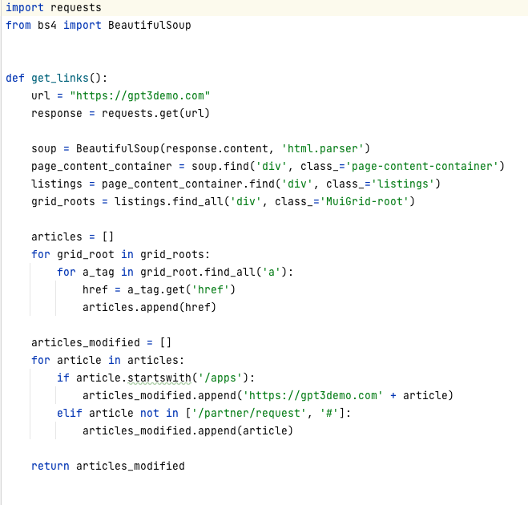
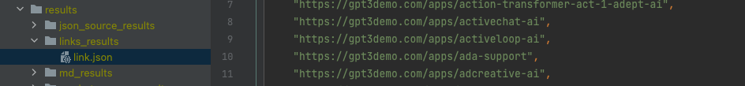

## ChatGPT帮我实现gpt3demo 爬虫Prompt记录，并生成Markdown文件

### 获取列表

```text

Now, you are an expert who is proficient in crawler technology.
I want to crawl the content of the website through python and process it. Please help me complete an executable python code.
Python version: 3.11
Website link: https://gpt3demo.com
1.Find elements whose class attribute is equal to 'page-content-container'
2.Find all elements whose class attribute value is equal to 'listings' under the element which obtained from previous step
3.Find all elements whose class attribute value contains 'MuiGrid-root' under the elements which obtained from previous step
4.Traverse the list of elements obtained from the previous step, and retrieve the values of the href attribute of all 'a' tags
5.Traverse the list which obtained from the previous step,
judge whether the prefix of the item is equal to '/apps',if so, Concatenate string:'https://gpt3demo.com/' in front of the current item,
if not, remove the current item
6.Save the list which obtained from the previous step in a json file named articleList.json using json schema
7.After save successfully, remove file named articleList.json

```

### 循环获取单个详细介绍

```text

Now, you are an expert who is proficient in crawler technology.
I want to crawl the content of the website through python and process it. Please help me complete an executable python code.
Python version: 3.11
Website link: https://gpt3demo.com/apps/teamsmart-ai
Here are the steps I want to handle:
1: Crawl the html code of the website, and get all the html codes under the tag whose class value is 'listing-body'.
2: Parse the html code obtained in the first step, and start filtering the elements in the html code.
Filter criteria:
keep the element if array: ['h1', 'h2', 'section'] contains the current element tag name.
and only keep the first element whose tag name is 'section'
3. keep the element whose tag name is equal to 'section'.
4: At this step, we have obtained the filtered html elements, now we need to convert each of them into json format.
Conversion logic:
Parsing the html code, each element should be converted into a json object, the json object has two fields, name: 'tag', 'content'.
the value of 'tag' is the element tag name.
Get the HTML code of an element and ensure that the code is compressed into a single line, and set to the value of the 'content' field
4: Save the converted json data to a file, file name: result.json
just show me the complete python code

```

### 效果






### 加入星球学习更多、相互交流、谈合作

* ChatGPT帮我实现React前端项目
* ChatGPT帮我实现Python项目
* ChatGPT帮我实现Java后端项目
* [高阶] ChatGPT帮我实现Visual Studio Code插件
* [高阶] ChatGPT帮我实现Python爬虫
* [高阶] ChatGPT帮我实现自动发微信公众号
* [高阶] ChatGPT帮我实现自动发星球动态
* [高阶] ChatGPT帮我爬油管、创造短视频
* [高阶] ChatGPT帮我发送抖音和Tiktok
* 更多课程等你来参与~


### 微信加好友了解细节
